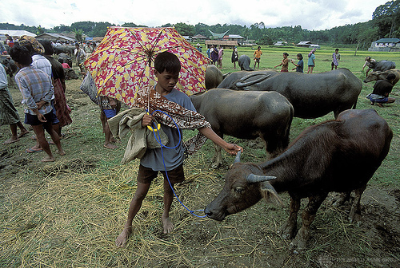

[](https://zenodo.org/doi/10.5281/zenodo.10659509)

# Multimodal Learned Sparse Retrieval 

### 1. Create conda environment and install dependencies: 

Create `conda` environemt:
```
conda create --name lsr python=3.9
conda activate lsr
```
Install dependencies with `pip`
```
pip install -r requirements.txt
```

### 2. Train a model 
```
python train.py --data doruktarhan6/mscoco-blip2avg-dense --train_batch_size 512 --eval_batch_size 1024  --q_reg 0.001 --d_reg 0.001  --temp 0.001 --use_amp --epochs 200 
```
List of available datasets: 
| HF's repo | Dense Model | Dataset | 
| ------- | ---- | ---- | 
| ```lsr42/mscoco-blip-dense``` | BLIP | MSCOCO  | 
| ```lsr42/flickr30k-blip-dense``` | BLIP | Flickr30k | 
| ```lsr42/mscoco-albef-dense``` | ALBEF | MSCOCO |
| ```lsr42/flickr30k-albef-dense``` | ALBEF | Flickr30k | 

### 3. Load a pretrained model and run inference 

To load a pretrained model:
```python
from model import D2SModel 
import torch 
from transformers import AutoTokenizer 
from datasets import load_dataset

# load a pretrained model 
model = D2SModel.from_pretrained("lsr42/d2s_mscoco-blip-dense_q_reg_0.001_d_reg_0.001")

# run inference on an example 
example = load_dataset("lsr42/mscoco-blip-dense", data_files = {"img_embs": "img_embs.parquet"})['img_embs'][2]
with torch.no_grad():
    sparse_dense = model(torch.tensor(example["emb"]).unsqueeze(0)).squeeze()
    
# converting sparse output vector to a bag of words 
tokenizer = AutoTokenizer.from_pretrained("distilbert-base-uncased")
weights, indices = sparse_dense.topk(20)
tokens = tokenizer.convert_ids_to_tokens(indices)
print(dict(zip(tokens, weights.tolist())))  
```
In the above example: 

The input image (ID=2):


The expected output: 
```javascript
{
    'animals': 1.6845930814743042,
    'boy': 1.6150918006896973,
    'buffalo': 1.5109654664993286,
    'animal': 1.3620645999908447,
    'people': 1.3547499179840088,
    'walking': 1.3171292543411255,
    'cow': 1.3011924028396606,
    'child': 1.2838903665542603,
    'man': 1.2704205513000488,
    'crowd': 1.2289572954177856,
    'cattle': 1.2129015922546387,
    'walks': 1.2014464139938354,
    'field': 1.1722053289413452,
    'person': 1.1201666593551636,
    'umbrella': 1.1023807525634766,
    'early': 1.090622067451477,
    'market': 1.083611249923706,
    'kid': 1.0726262331008911,
    'young': 1.0597232580184937,
    'ox': 1.0318571329116821
}
```
Note: 
- The actual association between *image_id* and and *the actual image path* in the dataset is stored in the `dataset_meta.json` file in each data repository, for example [here](https://huggingface.co/datasets/lsr42/mscoco-blip-dense/blob/main/dataset_meta.json) with the mscoco dataset. 
- Some other pretrained checkpoints are available in HuggingFace ([here](https://huggingface.co/lsr42?search_models=d2s)).

## Citing and Authors
If you find this repository helpful, please cite our paper [Multimodal Learned Sparse Retrieval with Probabilistic Expansion Control](link-to-be-updated)

```bibtex
@inproceedings{nguyen2024multimodal,
  title={Multimodal Learned Sparse Retrieval with Probabilistic Expansion Control},
  author={Nguyen, Thong and Hendriksen, Mariya and Yates, Andrew and  De Rijke, Maarten},
  booktitle={Advances in Information Retrieval: 46th European Conference on Information Retrieval, ECIR 2024, Glasgow, UK},
  year={2024},
  organization={Springer}
}
```

